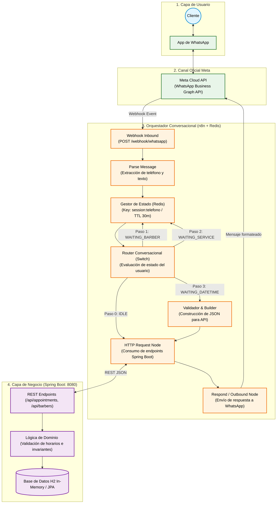
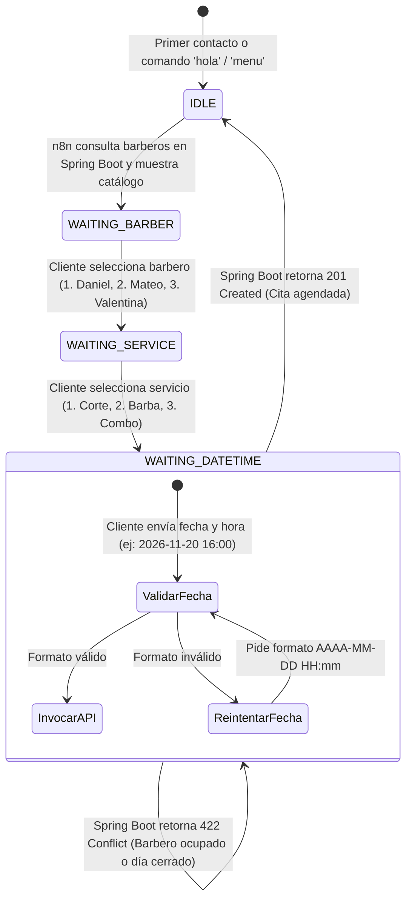

# 💈 Sistema Automatizado de Reserva de Turnos: WhatsApp + n8n + Spring Boot

Documentación técnica y operativa para la integración del canal oficial de **WhatsApp Business (Meta Cloud API)** con la API de negocio **Spring Boot (`dhbarber-mvp`)** mediante el orquestador conversacional **n8n** y **Redis**.

---

## 1. Arquitectura General del Sistema

El sistema implementa un desacoplamiento total entre la lógica de negocio y la experiencia conversacional asíncrona de WhatsApp:



---

## 2. Los 4 Componentes y sus Roles

| Componente | Tecnología | Rol Principal |
| :--- | :--- | :--- |
| **Capa de Usuario y Canal** | WhatsApp & Meta Cloud API | Interfaz final del cliente; envía eventos webhook HTTP POST ante cada mensaje y entrega respuestas formateadas. |
| **Gestor de Sesión** | Redis (`dhbarber-redis:6379`) | Mantiene el contexto conversacional del usuario por número de teléfono (`session:+549...`) con expiración automática de 30 minutos. |
| **Orquestador Conversacional** | n8n (`dhbarber-n8n:5678`) | Controla la máquina de estados, valida entradas, transforma formatos y consume las APIs de negocio. |
| **Core Backend** | Spring Boot (`peluqueria-daniel:8080`) | Fuente única de la verdad: barberos activos, turnos agendados, reglas de negocio e invariantes con estándar RFC 9457. |

---

## 3. Máquina de Estados de la Conversación

WhatsApp no envía formularios completos de una sola vez; la interacción es mensaje a mensaje. El estado se gestiona en Redis con la clave `session:<numero_telefono>`:



---

## 4. Endpoints del Backend Spring Boot Consumidos

### 4.1. Consultar Barberos Activos
- **Método y Ruta:** `GET /api/barbers`
- **Uso en n8n:** Al recibir "hola" o en estado `IDLE`, para armar el menú dinámico sin quemar los nombres en el bot.

### 4.2. Reservar Turno
- **Método y Ruta:** `POST /api/appointments`
- **Uso en n8n:** En el estado `WAITING_DATETIME` cuando el payload está validado.
- **Payload construido por n8n:**
```json
{
  "barberId": "barber-mateo",
  "customerId": "carlos-mendoza",
  "customerPhone": "+5491155551234",
  "serviceIds": ["corte-fade"],
  "startTime": "2026-11-20T17:30:00",
  "durationMinutes": 45
}
```

### 4.3. Rechazo de Invariantes de Negocio (RFC 9457 ProblemDetail)
Si un barbero ya tiene cita en ese rango horario o el horario está fuera de atención, la API responde con un `HTTP 422`:
```json
{
  "type": "https://peluqueria-daniel.local/errors/domain-violation",
  "title": "Domain Invariant Violation",
  "status": 422,
  "detail": "El barbero barber-mateo ya cuenta con una cita en el rango horario solicitado",
  "instance": "/api/appointments"
}
```
El nodo **Format Booking Result** en n8n extrae el campo `detail` y se lo comunica con claridad al cliente por WhatsApp, manteniéndolo en el paso para que elija otro horario sin perder sus selecciones previas.

---

## 5. Funcionamiento Interno del Workflow de n8n

El workflow [`n8n/workflows/dhbarber_whatsapp_workflow.json`](file:///home/lgfh98/personal/lali/test-1/n8n/workflows/dhbarber_whatsapp_workflow.json) se compone de 10 nodos clave:

1. **Webhook Inbound WhatsApp:**
   - Escucha peticiones POST en `/webhook/whatsapp` (producción) y `/webhook-test/whatsapp` (pruebas).
   - Configurado con `responseMode: "responseNode"` para responder con el mensaje resultante.
2. **Parse Incoming Message (Code Node):**
   - Extrae con seguridad `senderPhone`, `senderName`, y el texto o ID de botón interactivo presionado.
   - Filtra eventos de estado/entrega para evitar procesar mensajes vacíos.
3. **Redis Get Session:**
   - Consulta la clave `session:<senderPhone>` en el contenedor Redis.
   - Cuenta con `continueOnFail: true` para manejar nuevos usuarios sin errores.
4. **Session State Manager (Code Node):**
   - Si no hay sesión previa o el usuario envía "hola", "menu", "reiniciar", establece el estado en `IDLE`.
   - Si ya existía sesión, parsea el JSON previo y asigna los datos acumulados.
5. **Router Conversacional (Switch Node v3):**
   - Evalúa `session.state` mediante expresión matemática y divide el flujo en 4 ramas:
     - Rama 0: `IDLE` (Presentar barberos).
     - Rama 1: `WAITING_BARBER` (Procesar barbero elegido).
     - Rama 2: `WAITING_SERVICE` (Procesar servicio elegido).
     - Rama 3: `WAITING_DATETIME` (Procesar fecha y hora).
6. **API: Get Barbers & Build Welcome Menu:**
   - Llama a `http://host.docker.internal:8080/api/barbers` y construye el menú interactivo con números del 1 al 3.
7. **Process Barber Selection & Process Service Selection:**
   - Vinculan la selección del usuario con los IDs reales del sistema (`barber-daniel`, `barber-mateo`, `corte-fade`, `perfilado-barba`).
8. **Validator & Payload Builder:**
   - Normaliza fechas en formato `AAAA-MM-DD HH:mm` y construye el objeto exacto para Spring Boot.
9. **API: Book Appointment & Format Booking Result:**
   - Ejecuta el POST a Spring Boot.
   - Si el status es 201: Genera mensaje de confirmación con código de turno y reinicia el estado a `IDLE`.
   - Si el status es 422: Informa el conflicto y mantiene el estado en `WAITING_DATETIME`.
10. **Redis Save Session & Respond to Webhook:**
    - Guarda el nuevo estado en Redis con `ttl: 1800` (30 minutos).
    - Despacha la respuesta HTTP inmediata al webhook.

---

## 6. Guía de Ejecución y Pruebas

### 6.1. Requisitos Previos Levantados
1. **Spring Boot Backend:**
   ```bash
   cd /home/lgfh98/personal/lali/test-1/dhbarber-mvp
   ./gradlew bootRun
   ```
2. **Stack n8n + Redis:**
   ```bash
   cd /home/lgfh98/personal/lali/test-1
   docker compose up -d
   ```

### 6.2. Dos Formas de Probar el Flujo

#### A. Prueba de Conversación Completa (Modo Producción)
Simula a un cliente chateando desde su teléfono:
```bash
./scripts/simulate_whatsapp_chat.py
```
Permite ingresar:
1. `hola` ➔ Muestra barberos disponibles.
2. `2` ➔ Selecciona a Mateo Silva.
3. `1` ➔ Selecciona Corte Fade (45 min).
4. `2026-11-20 17:30` ➔ Agendar el turno y recibir el código de cita.

#### B. Prueba Visual en Vivo en la Pantalla de n8n (Modo Test Canvas)
1. Abre tu navegador en **`http://localhost:5678/workflow/WfBarberAssist01`**.
2. Haz clic en el botón naranja inferior: **"Execute workflow"** (o *"Test workflow"*).
3. En la terminal ejecuta:
   ```bash
   ./scripts/test_canvas_live.sh
   ```
4. Verás los nodos iluminarse en verde en tu navegador y podrás inspeccionar el JSON de cada nodo.

---

## 7. Paso a Paso para Conexión Real con Meta Cloud API

Para llevar el sistema a producción con un número de WhatsApp real:

1. **Crear App en Meta for Developers:**
   - Ingresa a [developers.facebook.com](https://developers.facebook.com).
   - Crea una app tipo **Business** y agrega el producto **WhatsApp**.
2. **Exponer n8n a Internet mediante un Túnel Seguro:**
   - Como n8n corre en local (`localhost:5678`), Meta necesita una URL pública HTTPS:
     ```bash
     # Usando Cloudflare Tunnel
     cloudflared tunnel --url http://localhost:5678
     # O usando Ngrok
     ngrok http 5678
     ```
3. **Configurar el Webhook en Meta:**
   - En el panel de WhatsApp de Meta, ve a **Configuration > Webhook**.
   - **Callback URL:** `https://tu-url-publica.com/webhook/whatsapp`
   - **Verify Token:** El token secreto acordado (ej. `dhbarber_secret_token_123`).
   - En campos de suscripción, activa: `messages`.
4. **Activar Salida Real:**
   - En el nodo `Outbound Meta WhatsApp`, ingresa tu **Phone Number ID** y tu **Access Token** de Meta para que los mensajes salgan directamente al celular del cliente.
